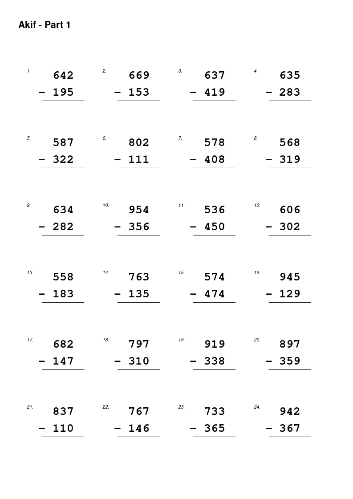
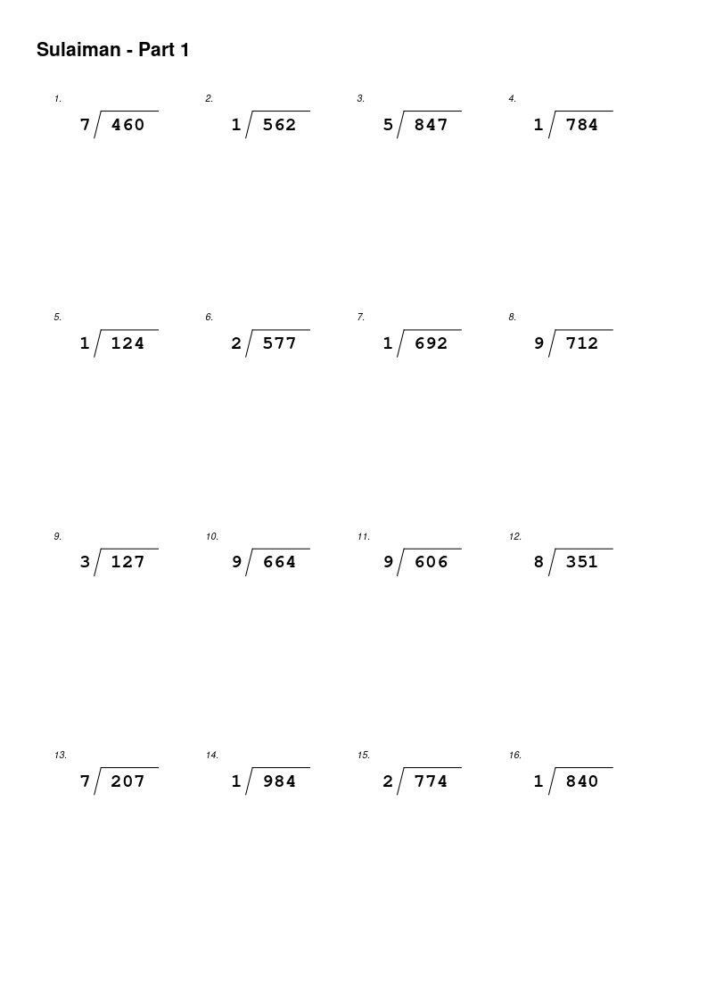
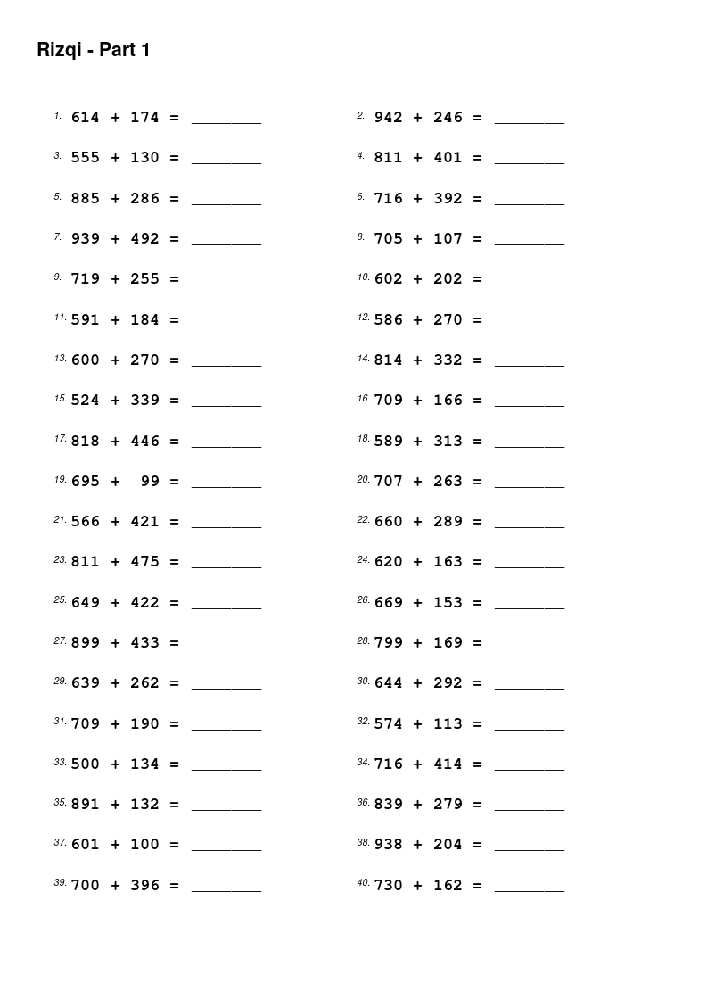
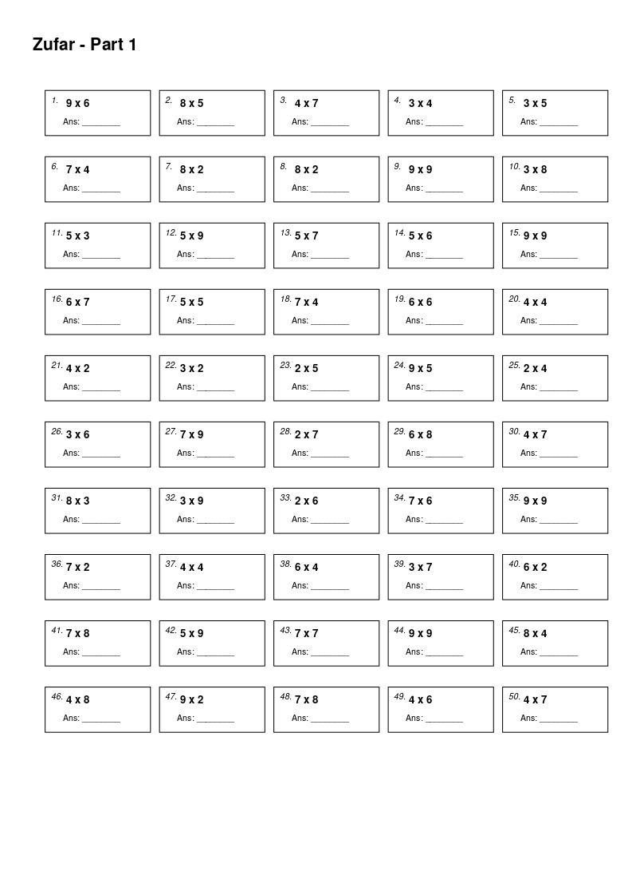
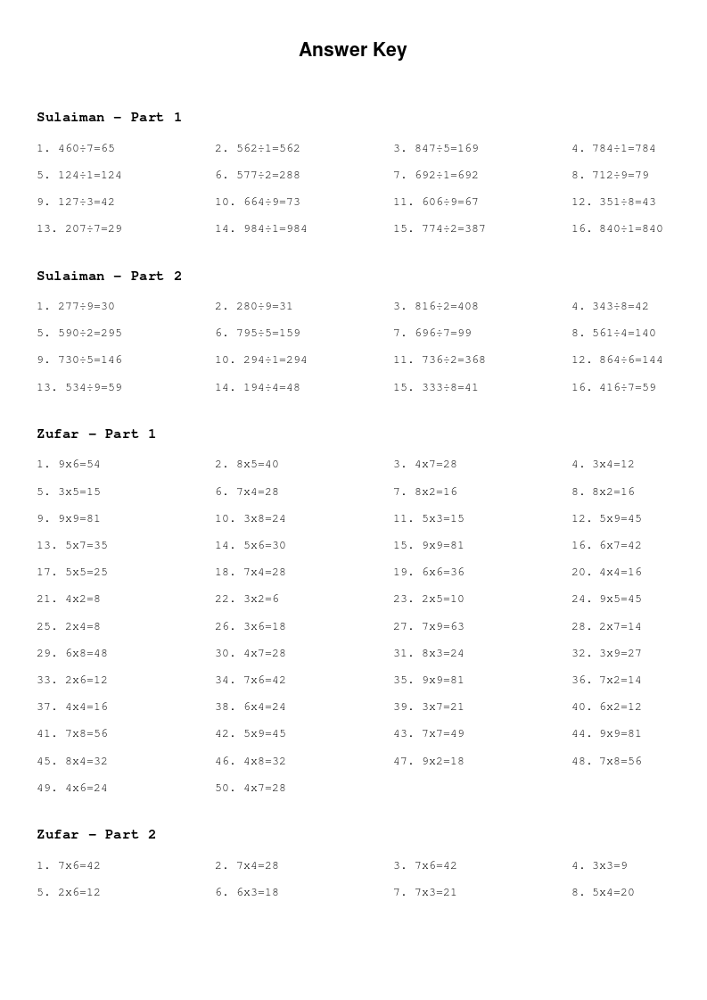

# MathWorkbook

A Python-based utility to generate customizable math practice worksheets in PDF format. This tool allows for highly tailored difficulty tiers and multiple visual layouts, making it perfect for students at different learning stages.

## Features

- **Config-Driven:** Define problem ranges, operations, page counts, and layouts in a single config.yml file.
- **Multiple Layout Styles:**
    - *Expanded*: Traditional vertical alignment (24 problems/page).
    - *List*: Horizontal equations with result lines (40 problems/page).
    - *Grid*: Problems contained within boxed cells (50 problems/page).
- **Smart Logic:**
    - Supports Addition (+), Subtraction (-), Multiplication (*), and Division (/).
    - Automatic subtraction correction to ensure positive results.
    - Dynamic font sizing and alignment based on the selected layout.
    - Intelligent division generation using digit constraints.
- **Automated Answer Key:** Generates a comprehensive answer key at the end of the PDF, indexed by Tier and Page.

## Installation

Clone the repository:

```
git clone --depth=1 https://github.com/akirasy/MathWorkbook.git
```

> Python dependencies is included in this repository.
> There is no need to install any python module.

## Configuration (`config.yml`)

The `config.yml` file defines your workbook structure. Parameters change based on the selected `operation`.

### 1. Standard Operations (+, -, *)

Use these for addition, subtraction, or multiplication.
```
- name: "Zufar"
  min_top: 2
  max_top: 9
  min_bot: 2
  max_bot: 9
  operation: "x"
  pages: 4
  layout: "grid"
```

### 2. Division Operation (/)

For division, the script uses digit-based constraints instead of min/max values.
```
- name: "Sulaiman"
  dividend_digit: 3 
  divisor_digit: 1
  operation: "/"
  pages: 2
  layout: "expanded"
```

### Layout Comparison

| Layout | Problems per Page | Best For |
|:-:|:-:|---|
| Expanded | 24 | Long-form vertical calculation |
| List | 40 | Mental math and quick drills |
| Grid | 50 | High-density practice in a structured box |

## Gallery: Layout Examples

### Vertical & Long-Form (Expanded)

| Subtraction | Division |
|:---:|:---:|
|  |  |

### Drill & Grid Formats

| Addition (List) | Multiplication (Grid) |
|:---:|:---:|
|  |  |

### Answer Key

| Addition (List) |
|:---:|
|  |

## Usage

Run the generator from your terminal:

```
python main.py
```

The PDF will be generated using the name specified in your configuration file.
